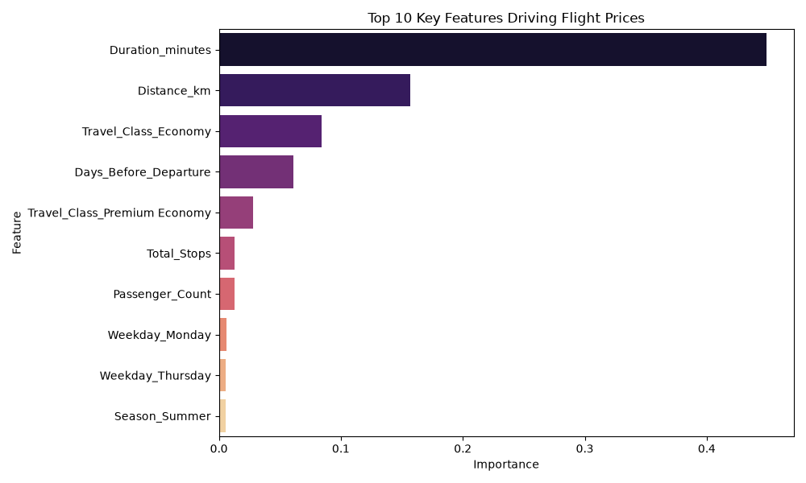
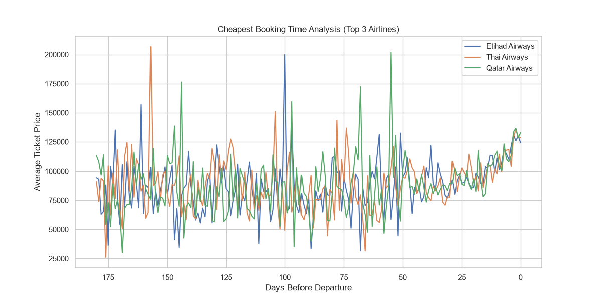

# ✈️ AI Travel Analyst Dashboard

🚀 **[Click Here to view the Live Application](https://fare-oracle-flight-predictor-fwfonsmyrihfesnkfrshbi.streamlit.app/)**

## 📌 Project Overview
The **AI Travel Analyst** is a full-stack Data Science and Machine Learning application built for the MIC AIML Department Recruitment Challenge (Track 3). It goes beyond standard Jupyter Notebooks by offering a production-ready, dual-role SaaS application. Consumers ("Travelers") can use the app to find flight recommendations and predict ticket prices, while Administrators can access a secure MLOps backend to upload new data, view Exploratory Data Analysis (EDA) graphs, and dynamically retrain the Machine Learning models.

## 🎯 Problem Statement
Flight prices are highly volatile and confusing for consumers. The goal of this project is to ingest a massive, messy dataset of historical flight prices, clean it, and build an intelligent system that can:
1. Identify the major factors driving flight prices.
2. Predict future ticket prices using Machine Learning.
3. Calculate the mathematical "Sweet Spot" (cheapest day to book) to save consumers money.

## ⚙️ Installation Instructions
To run this project locally on your machine:
1. Clone this repository:
   ```bash
   git clone <your-repository-url>
   cd MIC_Project
   ```
2. Install the required Python libraries:
   ```bash
   pip install pandas numpy scikit-learn streamlit matplotlib seaborn
   ```
3. Launch the web dashboard:
   ```bash
   streamlit run app.py
   ```
**Login Details:**
* **Traveler Role:** Open by default.
* **Administrator Role:** Select "Administrator" in the sidebar and enter the password: `admin123`.

## 📊 Dataset Used
The project utilizes the `flight_pricing_dataset.csv` provided for the hackathon. 
* **Size:** Over 100,000 raw flight records.
* **Features:** Airline, Source, Destination, Travel Class, Total Stops, Distance (km), Days Before Departure, and Price.
* **Cleaning:** The dataset required heavy preprocessing to remove strings from numeric columns (e.g., converting "4191.4 km" to pure floats) and mapping text data (e.g., "non-stop" to `0`).

## 🧪 Methodology
1. **Part 1 (Exploratory Data Analysis):** Missing values were imputed and text anomalies were stripped using Regex. We generated 5 distinct visualizations (Histograms, Barplots, Boxplots, Correlation Matrices) to identify pricing trends.
2. **Part 2 (Predictive Modeling):** Categorical data was transformed using One-Hot Encoding. The data was split 80/20. We raced three models against each other: **Linear Regression, Decision Tree, and Random Forest**.
3. **Part 3 (Advanced Analytics):** We mathematically grouped the data to find the lowest average price corresponding to the `Days_Before_Departure`, finding the precise booking "Sweet Spot".
4. **Consumer Features (Traveler View):**
   * **Flight Finder (Recommendation Engine):** A custom tool that filters flights by route and ranks the top 3 best flights based on a custom "Value Score" (balancing ticket price and flight duration).
   * **Smart Alerts:** Cross-references the user's booking timeframe with the historical sweet spot to flash dynamic alerts (e.g., Red for last-minute price surge warnings, Green for optimal booking windows).
5. **UI Architecture:** We deployed a Dual-Role architecture using Streamlit's Session State, injected with custom HTML/CSS (Glassmorphism) to achieve a Vercel-style frontend.

## 💻 Technologies Used
* **Data Processing:** Python, Pandas, Numpy
* **Machine Learning:** Scikit-Learn (RandomForest, DecisionTree, LinearRegression)
* **Data Visualization:** Matplotlib, Seaborn
* **Web Deployment:** Streamlit (with custom HTML/CSS for UI override)

## 📈 Results
* **Winning Model:** The **Random Forest Regressor** won the Model Comparison Race, achieving the highest R-Squared Accuracy and lowest Mean Absolute Error.
* **Primary Price Drivers:** Our Feature Importance extraction proved that *Travel Class* and *Days Before Departure* are the strongest predictors of price.
* **Booking Sweet Spot:** Across all airlines, the global sweet spot to book is exactly **176 days** in advance. However, this varies heavily by airline (e.g., Etihad is cheapest 68 days out).

## ⚠️ Challenges Faced
* **Data Formatting Anomalies:** The raw dataset contained unexpected text inside numerical columns (e.g., the word "one" instead of the number 1, or "days" attached to integers). This initially crashed the Scikit-Learn algorithms. We solved this by writing a robust, dynamic Regex cleaning pipeline.
* **UI Limitations:** Streamlit natively looks like an internal data dashboard, not a consumer website. We overcame this by injecting custom CSS to hide standard Streamlit navigation, applying edge-to-edge padding, and using Glassmorphism to create a premium SaaS aesthetic.

## 🚀 Future Improvements
* **Continuous Training (MLOps):** Upgrading from a static CSV to a live **Supabase PostgreSQL** database, allowing a web-scraper to ingest real-time flight prices daily to automatically retrain the model.
* **Model Explainability:** Integrating the **SHAP** library to provide users with exact mathematical breakdowns of why their specific ticket was priced the way it was.
* **Frontend Decoupling:** Migrating the Traveler-facing side of the app to a custom **Next.js/React** frontend deployed on Vercel, while connecting it to the Random Forest model via a **FastAPI** Python backend.

## 📸 Screenshots
*(Below are examples of the data visualizations generated by the Admin MLOps backend)*

### AI Feature Importance


### Booking Sweet Spot Analysis

